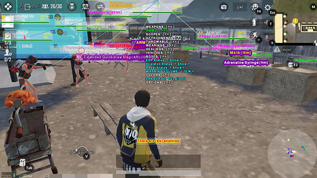

# PUBG 2.7 ESP Hack for Emulator (C++ Source Code)

---
|**\* GoodDie PUBG Hack**|
| --- |
|**\* This is not the full protected version**|
|**\* More tools will be added in the next version 2.8**|
---

PUBG ESP Hack for Emulator using C++ code.\
Player Position, Bones, Loots, Weapons, Vehicles, Boxes ... etc.

* **Auther** : Programmer / Ayman

## How to use
* Extract code files into directory :
C:\Projects\PUBGHack\

* Download SFML library for [ Visual C++ 15 (2017) - 64-bit ]
https://www.sfml-dev.org/download/sfml/2.5.1/
Extract library folder into :
C:\Projects\PUBGHack\

* Make sure you are using "Release" & "x64" for debug mode
Open project properties (Alt + F7)
Set "Configuration" as "Release" and set "Platform" as "x64"
 ** From tab "C/C++" select "General"
From right section, beside "Additional Include Directories" insert the library include directory :
C:\Projects\PUBGHack\SFML-2.5.1\include
 ** From tab "Linker" select "General"
From right section, beside "Additional Library Directories" insert the library directory :
C:\Projects\PUBGHack\SFML-2.5.1\lib
 ** From tab "Linker" select "Input"
From right section, beside "Additional Dependencies" append :
sfml-audio.lib
sfml-graphics.lib
sfml-system.lib
sfml-window.lib
 ** Then click "OK"

* Copy all files that doesn't contains prefix "-d-2" from "C:\Projects\PUBGHack\SFML-2.5.1\bin\" to "C:\Projects\PUBGHack\x64\Release\"
openal32.dll
sfml-audio-2.dll
sfml-graphics-2.dll
sfml-network-2.dll
sfml-system-2.dll
sfml-window-2.dll

* Add any font file has ".ttf" extension after naming it as "GoodDie.ttf" to the folder "C:\Projects\PUBGHack\x64\Release\"

* Add ".wav" file "resources\GoodDieAlert.wav" to the folder "C:\Projects\PUBGHack\x64\Release\", or you can add any ".wav" file using the same name

* Compiling :
Choose batch build for "Release|x64"

* Loading the driver :
Disable your antivirus and its self-defense
Download and setup "processhacker-2.38-setup.exe"
Make sure its the correct version "2.38"
Make sure to check the box in front of "Install KProcessHacker driver and allow unrestricted access (not recommended)" while setting up the program

* After releasing the application all these files should be in one folder :
GoodDie.exe
openal32.dll
sfml-audio-2.dll
sfml-graphics-2.dll
sfml-network-2.dll
sfml-system-2.dll
sfml-window-2.dll
GoodDie.ttf
GoodDieAlert.wav

* Make sure to disable antivirus and its self-defense
* Make sure to run the application as "Administrator"

## About
* This is for educational purposes only and I don't encorage using hacking
* This is not shared app or ready to use application, it is just example for how to use memory reader and to know how games working
* There are many ways to avoid ban but I will not talk about them in this tutorial
* Using this code as it is without any protection, may cause ban for your account and it is only on your responsibility

## My work
* Radar points for enemies
* Updating offsets for latest version of the game
* Updating items name and adding the neo
* Different color for each player (in the same team) for enemy line and radar point
* Menu controller for every single item to control its appearence
* Different color for each item type (weapons, vehicles, throwables ... etc.)
* Fix issues to perform speed and smooth working for the application
* And more

## Working on
* Dead player box and airdrop items list
* Car fuel and health
* Write on memory (Fast landing speed, Auto aim, Magic bullet, Car speed, Flying car, High jump and Fast running)

## References
@[github/atiksoftware](https://github.com/atiksoftware/pubg_mobile_memory_hacking_examples)\
@[www.unknowncheats.me](https://www.unknowncheats.me/forum/playerunknown-s-battlegrounds/)
